# 🚀 DSA LeetCode Solutions

  

### 💡 A comprehensive collection of LeetCode problems and solutions
*Mastering Data Structures & Algorithms one problem at a time!*

---

## 📊 Progress Overview

| Difficulty | Solved | Total | Percentage |
|------------|--------|-------|------------|
| 🟢 Easy | 4 | ∠|  |
| 🟡 Medium | 4 | ∠|  |
| 🔴 Hard | 0 | ∠|  |

---

## 🎯 Topic-wise Solutions

### 📈 Array Problems
> *Master the fundamentals of array manipulation and traversal*

| # | Problem | Difficulty | Solution | Tags |
|---|---------|------------|----------|------|
| 15 | [3Sum](https://github.com/Guna42/DSA-LEETCODE/tree/master/0015-3sum) | 🟡 Medium | [View](https://github.com/Guna42/DSA-LEETCODE/tree/master/0015-3sum) | `Array` `Two Pointers` `Sorting` |
| 16 | [3Sum Closest](https://github.com/Guna42/DSA-LEETCODE/tree/master/0016-3sum-closest) | 🟡 Medium | [View](https://github.com/Guna42/DSA-LEETCODE/tree/master/0016-3sum-closest) | `Array` `Two Pointers` `Sorting` |
| 66 | [Plus One](https://github.com/Guna42/DSA-LEETCODE/tree/master/0066-plus-one) | 🟢 Easy | [View](https://github.com/Guna42/DSA-LEETCODE/tree/master/0066-plus-one) | `Array` `Math` |
| 121 | [Best Time to Buy and Sell Stock](https://github.com/Guna42/DSA-LEETCODE/tree/master/0121-best-time-to-buy-and-sell-stock) | 🟢 Easy | [View](https://github.com/Guna42/DSA-LEETCODE/tree/master/0121-best-time-to-buy-and-sell-stock) | `Array` `Dynamic Programming` |
| 189 | [Rotate Array](https://github.com/Guna42/DSA-LEETCODE/tree/master/0189-rotate-array) | 🟡 Medium | [View](https://github.com/Guna42/DSA-LEETCODE/tree/master/0189-rotate-array) | `Array` `Math` `Two Pointers` |
| 283 | [Move Zeroes](https://github.com/Guna42/DSA-LEETCODE/tree/master/0283-move-zeroes) | 🟢 Easy | [View](https://github.com/Guna42/DSA-LEETCODE/tree/master/0283-move-zeroes) | `Array` `Two Pointers` |
| 1603 | [Running Sum of 1d Array](https://github.com/Guna42/DSA-LEETCODE/tree/master/1603-running-sum-of-1d-array) | 🟢 Easy | [View](https://github.com/Guna42/DSA-LEETCODE/tree/master/1603-running-sum-of-1d-array) | `Array` `Prefix Sum` |
| 2058 | [Concatenation of Array](https://github.com/Guna42/DSA-LEETCODE/tree/master/2058-concatenation-of-array) | 🟢 Easy | [View](https://github.com/Guna42/DSA-LEETCODE/tree/master/2058-concatenation-of-array) | `Array` `Simulation` |

---

## 🏷️ Problems by Topic

<b>🔢 Array (8 problems)</b>

- **Easy**: Plus One, Best Time to Buy and Sell Stock, Move Zeroes, Running Sum of 1d Array, Concatenation of Array
- **Medium**: 3Sum, 3Sum Closest, Rotate Array
- **Hard**: None yet

<b>🯠Two Pointers (4 problems)</b>

- **Easy**: Move Zeroes
- **Medium**: 3Sum, 3Sum Closest, Rotate Array
- **Hard**: None yet

<b>🔢 Math (2 problems)</b>

- **Easy**: Plus One
- **Medium**: Rotate Array
- **Hard**: None yet

<b>📊 Sorting (2 problems)</b>

- **Easy**: None yet
- **Medium**: 3Sum, 3Sum Closest
- **Hard**: None yet

<b>💡 Dynamic Programming (1 problem)</b>

- **Easy**: Best Time to Buy and Sell Stock
- **Medium**: None yet
- **Hard**: None yet

<b>➕ Prefix Sum (1 problem)</b>

- **Easy**: Running Sum of 1d Array
- **Medium**: None yet
- **Hard**: None yet

<b>🮠Simulation (1 problem)</b>

- **Easy**: Concatenation of Array
- **Medium**: None yet
- **Hard**: None yet

---

## 🛠️ Technologies Used

| Language | Problems Solved | Preference |
|----------|-----------------|------------|
|  | Most | ⭐⭐⭐⭐⭐ |
|  | Some | ⭐⭐⭐⭐ |
|  | Few | ⭐⭐⭐ |

---

## 📈 Learning Journey

```mermaid
graph LR
    A[🚀 Start Journey] --> B[🟢 Easy Problems]
    B --> C[🔢 Arrays & Strings]
    C --> D[🎯 Two Pointers]
    D --> E[🟡 Medium Problems]
    E --> F[📊 Advanced Topics]
    F --> G[🔴 Hard Problems]
    G --> H[🏆 Interview Ready]
```

---

## 🎯 Current Focus

- 🔥 **Mastering Array Fundamentals**
- 🎯 **Two Pointers Technique**
- 📊 **Dynamic Programming Basics**
- 🧮 **Mathematical Problem Solving**

---

## 📚 Resources & References

| Resource | Description | Link |
|----------|-------------|------|
| 📖 **LeetCode** | Primary practice platform | [Visit](https://leetcode.com/) |
| 🚀 **LeetHub v2** | Auto-sync solutions to GitHub | [GitHub](https://github.com/arunbhardwaj/LeetHub-2.0) |
| 📊 **Algorithm Patterns** | Common problem-solving patterns | [Patterns](https://github.com/SeanPrashad/leetcode-patterns) |
| 💡 **Interview Tips** | Coding interview preparation | [Tips](https://github.com/jwasham/coding-interview-university) |

---

## 🤝 Connect & Contribute

**Found this helpful? Give it a ⭐!**

---

## 📊 Repository Stats

---

### 💭 *"The journey of a thousand algorithms begins with a single array."*

**Keep coding, keep growing! 🚀**

---

*Last updated: August 22, 2025 | Auto-synced with [LeetHub v2](https://github.com/arunbhardwaj/LeetHub-2.0)*

<!---LeetCode Topics Start-->
# LeetCode Topics
## Array
|  |
| ------- |
| [0026-remove-duplicates-from-sorted-array](https://github.com/Guna42/DSA-LEETCODE/tree/master/0026-remove-duplicates-from-sorted-array) |
| [0027-remove-element](https://github.com/Guna42/DSA-LEETCODE/tree/master/0027-remove-element) |
| [0088-merge-sorted-array](https://github.com/Guna42/DSA-LEETCODE/tree/master/0088-merge-sorted-array) |
| [0169-majority-element](https://github.com/Guna42/DSA-LEETCODE/tree/master/0169-majority-element) |
| [0219-contains-duplicate-ii](https://github.com/Guna42/DSA-LEETCODE/tree/master/0219-contains-duplicate-ii) |
| [0350-intersection-of-two-arrays-ii](https://github.com/Guna42/DSA-LEETCODE/tree/master/0350-intersection-of-two-arrays-ii) |
## Hash Table
|  |
| ------- |
| [0169-majority-element](https://github.com/Guna42/DSA-LEETCODE/tree/master/0169-majority-element) |
| [0219-contains-duplicate-ii](https://github.com/Guna42/DSA-LEETCODE/tree/master/0219-contains-duplicate-ii) |
| [0350-intersection-of-two-arrays-ii](https://github.com/Guna42/DSA-LEETCODE/tree/master/0350-intersection-of-two-arrays-ii) |
## Sliding Window
|  |
| ------- |
| [0219-contains-duplicate-ii](https://github.com/Guna42/DSA-LEETCODE/tree/master/0219-contains-duplicate-ii) |
## Divide and Conquer
|  |
| ------- |
| [0169-majority-element](https://github.com/Guna42/DSA-LEETCODE/tree/master/0169-majority-element) |
## Sorting
|  |
| ------- |
| [0088-merge-sorted-array](https://github.com/Guna42/DSA-LEETCODE/tree/master/0088-merge-sorted-array) |
| [0169-majority-element](https://github.com/Guna42/DSA-LEETCODE/tree/master/0169-majority-element) |
| [0350-intersection-of-two-arrays-ii](https://github.com/Guna42/DSA-LEETCODE/tree/master/0350-intersection-of-two-arrays-ii) |
## Counting
|  |
| ------- |
| [0169-majority-element](https://github.com/Guna42/DSA-LEETCODE/tree/master/0169-majority-element) |
## Two Pointers
|  |
| ------- |
| [0026-remove-duplicates-from-sorted-array](https://github.com/Guna42/DSA-LEETCODE/tree/master/0026-remove-duplicates-from-sorted-array) |
| [0027-remove-element](https://github.com/Guna42/DSA-LEETCODE/tree/master/0027-remove-element) |
| [0088-merge-sorted-array](https://github.com/Guna42/DSA-LEETCODE/tree/master/0088-merge-sorted-array) |
| [0345-reverse-vowels-of-a-string](https://github.com/Guna42/DSA-LEETCODE/tree/master/0345-reverse-vowels-of-a-string) |
| [0350-intersection-of-two-arrays-ii](https://github.com/Guna42/DSA-LEETCODE/tree/master/0350-intersection-of-two-arrays-ii) |
## Binary Search
|  |
| ------- |
| [0350-intersection-of-two-arrays-ii](https://github.com/Guna42/DSA-LEETCODE/tree/master/0350-intersection-of-two-arrays-ii) |
## String
|  |
| ------- |
| [0345-reverse-vowels-of-a-string](https://github.com/Guna42/DSA-LEETCODE/tree/master/0345-reverse-vowels-of-a-string) |
## Math
|  |
| ------- |
| [3279-alice-and-bob-playing-flower-game](https://github.com/Guna42/DSA-LEETCODE/tree/master/3279-alice-and-bob-playing-flower-game) |
<!---LeetCode Topics End-->